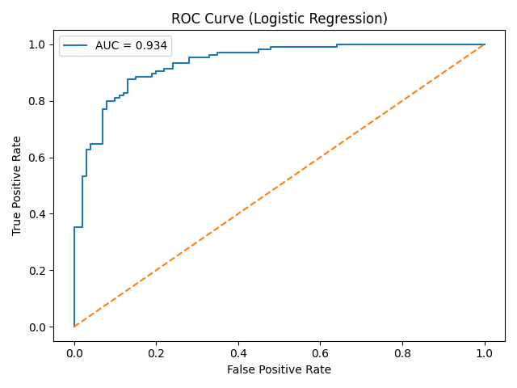

# 🫀 Heart Disease Prediction using Machine Learning

## Overview

This project predicts the presence of heart disease using clinical patient data.
The workflow includes Exploratory Data Analysis (EDA), feature interpretation, model training, validation, and ROC analysis.

The goal was to build an interpretable and reliable classifier rather than maximizing raw accuracy.

dataset: <https://www.kaggle.com/datasets/johnsmith88/heart-disease-dataset/data>

---

## Dataset

The dataset contains medically relevant features such as:

- Age
- Sex
- Chest pain type (cp)
- Resting blood pressure
- Cholesterol
- Maximum heart rate achieved (thalach)
- ST depression (oldpeak)
- ST segment slope (slope)
- Number of major vessels (ca)

Target:
- `0` → No Heart Disease  
- `1` → Heart Disease  

---

## Exploratory Data Analysis

Key observations:

- Dataset is relatively balanced.
- Chest pain type (`cp`), maximum heart rate (`thalach`), and ST slope (`slope`) show strong separation between classes.
- Cholesterol alone shows weak predictive power.
- Most features exhibit some correlation with the target due to the curated nature of the dataset.

---

## Models Used

### Logistic Regression (Primary Model)

- 5-fold Cross Validation Accuracy ≈ **85%**
- ROC AUC ≈ **0.88**

Logistic Regression was selected due to:

- Better generalization
- Interpretability
- Stability on small curated datasets

---

### Random Forest (Overfitting Analysis)

RandomForest achieved near-perfect accuracy (~99%) due to memorization on this small and highly engineered dataset.

After constraining tree depth, performance dropped closer to Logistic Regression.

Therefore, RandomForest was not selected as the final model.

---

## Feature Interpretation

Logistic Regression coefficients indicate:

- Chest pain type
- Maximum heart rate
- ST segment slope
- ST depression
- Exercise induced angina

as the strongest predictors.

These align with clinical understanding:
reduced exercise capacity and abnormal ECG patterns strongly indicate cardiovascular risk.

---

## Results

- Cross-validation accuracy: ~85%
- ROC AUC: ~0.93

---

## How to Run

```bash
pip install -r requirements.txt
python src/train.py
python src/evaluate.py
```

### Conclusion

-This project demonstrates a complete ML pipeline including EDA, feature reasoning, model validation, overfitting detection, and ROC analysis.
-Logistic Regression was chosen as the final model due to its robustness and interpretability.

---

### Author

Shivam Pratap Singh

---

## ROC Curve

